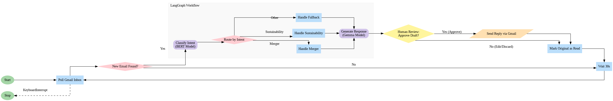

# Corporate Mail Assistant 🤖📧

An intelligent AI agent that automatically reads, classifies, and drafts replies to incoming corporate emails. Built with Python, LangGraph, and Hugging Face Transformers (BERT & Gemma).

## Workflow



## Features

  * **Automated Email Polling:** Continuously monitors a Gmail inbox for new, unread emails.
  * **Intent Classification:** Uses a fine-tuned BERT model to classify the intent of each email (e.g., "Merger Announcement," "Sustainability Initiative").
  * **Dynamic Workflow:** Leverages LangGraph to route tasks based on the classified intent.
  * **Contextual Reply Generation:** Uses a fine-tuned Gemma-2B model (with LoRA adapters) to generate context-aware, professional draft replies.
  * **End-to-End Automation:** Automatically sends the generated reply and marks the original email as read.

## How It Works: The Workflow

This project uses LangGraph to create a stateful graph that mimics a decision-making process.

1.  The main loop in `recieve_mail.py` polls the Gmail inbox.
2.  When an unread email is found, its content is passed to the `run_workflow` function from `main_graph.py`.
3.  **LangGraph Workflow Begins:**
      * **Node 1: `classify_intent`:** The email content is processed by the `IntentClassifier` (fine-tuned BERT) to determine its purpose.
      * **Conditional Edge:** Based on the intent, the graph routes to a specific handler node (e.g., `handle_merger`).
      * **Node 2: `handle_...`:** The handler node processes the request, gathers necessary details (e.g., pulling RAG data, creating a ticket ID).
      * **Node 3: `generate_response`:** The intent and details are passed to the `EmailGenerator` (fine-tuned Gemma-2B), which drafts a complete, formal reply.
4.  The final reply (subject and body) is returned to `recieve_mail.py`.
5.  The script uses the Gmail API to send the generated reply and marks the original email as read.

## Project Structure

```
.
├── .gitignore               # Tells Git what to ignore
├── config.py                # Central config for model paths
├── intent_classify.py       # Class for the BERT intent classifier
├── main_graph.py            # Defines the core LangGraph workflow
├── recieve_mail.py          # Main script: handles Gmail auth, polling, & sending
├── reply_generator.py       # Class for the Gemma reply generator
├── requirements.txt         # List of Python dependencies
│
├── credentials.json         # YOUR Google API credentials (Must add)
├── token.json               # Generated by Google Auth (Ignore)
│
├── mail_category/           # YOUR fine-tuned BERT model files
│   ├── config.json
│   ├── pytorch_model.bin
│   └── ...
│
└── fine_tuned_gemma_2b_adapters/ # YOUR fine-tuned Gemma adapter files
    ├── adapter_config.json
    ├── adapter_model.safetensors
    └── ...
```

## Setup & Installation

### 1\. Clone the Repository

```bash
git clone https://github.com/YourUsername/Corporate-Mail-Assistant.git
cd Corporate-Mail-Assistant
```

### 2\. Set up Google API Credentials

1.  Go to the [Google Cloud Console](https://console.cloud.google.com/).
2.  Create a new project.
3.  Enable the **Gmail API**.
4.  Create credentials for an **"OAuth client ID"**.
5.  Select **"Desktop app"** as the application type.
6.  Download the JSON credentials file and save it in the project root as `credentials.json`.

### 3\. Add Your Fine-Tuned Models

This project assumes you have already fine-tuned your models.

1.  **BERT Intent Model:** Place your fine-tuned BERT model files into the `mail_category` folder.
2.  **Gemma Adapters:** Place your fine-tuned Gemma LoRA adapters into the `fine_tuned_gemma_2b_adapters` folder.

### 4\. Install Dependencies

Install all the required Python packages:

```bash
pip install -r requirements.txt
```

## How to Run

1.  **First-time Authentication:**

      * Run the main script from your terminal:
        ```bash
        python recieve_mail.py
        ```
      * Your browser will automatically open, asking you to authorize the application to access your Gmail account.
      * Grant permissions. The script will create a `token.json` file to store your credentials for future runs.

2.  **Run the Assistant:**

      * Once authenticated, the script will start running:
        ```
        --- Configuration Loaded (Local Paths) ---
        ...
        --- LANGGRAPH WORKFLOW COMPILED ---
        --- LOADING MODELS (This happens once) ---
        ...
        --- MODELS LOADED ---
        Starting mail attender service...
        Service running. Ignoring emails received before startup.
        Checking for new mail every 30 seconds...
        ```
      * The assistant is now active. When a new email arrives in the authorized inbox, it will process it automatically.
